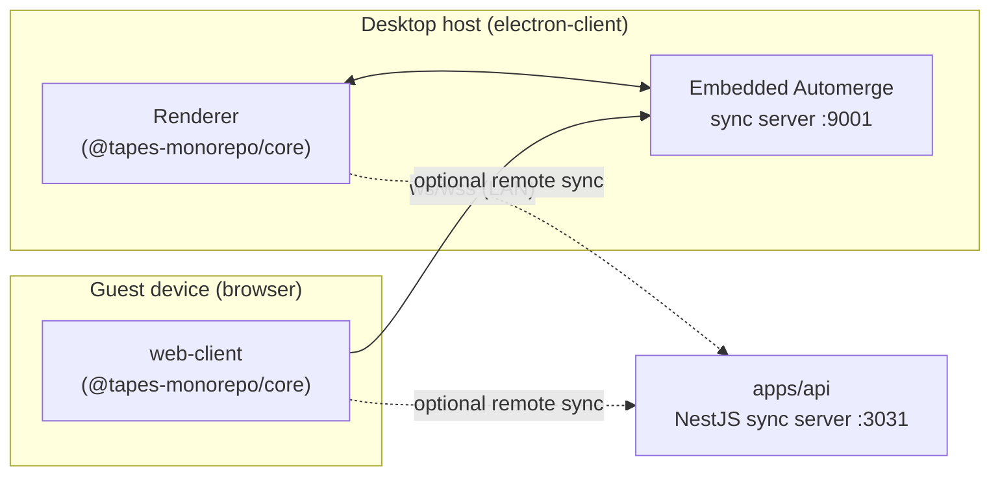

# Tapes

Tapes is a **local-first audio recording app**. You record audio in the browser,
and your recordings (and their metadata) are stored locally and synced
peer-to-peer across the devices on your local network using
[Automerge](https://automerge.org/) CRDTs — there is no central database.

The desktop app acts as the sync **host**: it persists the shared data and serves
the recording UI to other devices on the LAN. Those devices join as **guests**
(paired with a QR code) and record into the same synced library.

## Monorepo layout

This is a [Turborepo](https://turborepo.com/) monorepo managed with **Yarn 4**.

### Apps

| Package                | Description                                                                 | Dev port |
| ---------------------- | --------------------------------------------------------------------------- | -------- |
| `apps/web-client`      | Vite + React shell that mounts the Tapes app and captures microphone audio. | `3000`   |
| `apps/electron-client` | Desktop **host**: embeds `web-client`, runs the embedded LAN sync server.   | —        |
| `apps/api`             | Standalone NestJS Automerge sync server (alternative/remote sync backend).  | `3031`   |
| `apps/web`             | Next.js marketing / landing site.                                           | `3002`   |
| `apps/docs`            | Next.js documentation site.                                                 | `3001`   |

The electron host's embedded sync server listens on port `9001`.

### Packages

| Package                             | Description                                                                              |
| ----------------------------------- | ---------------------------------------------------------------------------------------- |
| `@tapes-monorepo/core`              | The actual Tapes application (`App`, views, context) plus Automerge sync and QR pairing. |
| `@tapes-monorepo/ui`                | Shared, presentational React component library (Tailwind).                               |
| `@tapes-monorepo/tailwind-config`   | Shared Tailwind theme.                                                                   |
| `@tapes-monorepo/eslint-config`     | Shared ESLint configurations.                                                            |
| `@tapes-monorepo/typescript-config` | Shared `tsconfig.json` bases.                                                            |

The Tapes UI lives in `@tapes-monorepo/core` (`packages/core/app/`) and is
consumed by both `web-client` and the electron renderer, so the same app runs in
the browser and inside the desktop host.

## Architecture



- `@tapes-monorepo/core` owns the Automerge repo: **IndexedDB** storage in the
  browser, and **WebSocket + BroadcastChannel** networking.
- Guests reach the host's embedded sync server over the LAN; the `web-client` dev
  server proxies `/sync` to it (see `apps/web-client/vite.config.ts`).
- `apps/api` is an independent Automerge sync server (filesystem-backed) that can
  act as a remote/cloud backend.

## Prerequisites

- **Node.js 24** (see [`.nvmrc`](./.nvmrc)). Enable Corepack so the pinned Yarn
  version is used: `corepack enable`.
- **Yarn 4** (declared via `packageManager`; provided by Corepack).
- **macOS is assumed for the full recording flow.** The dev scripts use
  `ipconfig getifaddr en0` to discover the LAN IP, and the desktop host shells out
  to [SoX](https://sourceforge.net/projects/sox/) (recording) and
  [`switchaudio-osx`](https://github.com/deweller/switchaudio-osx) (input
  selection). On Linux/Windows the non-audio parts build and run, but the
  end-to-end recording flow is not currently supported.

## Getting started

```sh
corepack enable   # once, to activate the pinned Yarn 4
yarn              # install dependencies
yarn dev          # start all apps in dev mode
```

### Local HTTPS (`yarn dev:https`)

Browsers only expose the microphone in a **secure context**, so LAN guests
recording over HTTP won't work — you need HTTPS on the LAN IP:

```sh
yarn dev:https
```

This runs `core`, `web-client` (TLS via `@vitejs/plugin-basic-ssl`), the electron
host (advertising an `https://<lan-ip>:3000` URL to guests), and `api`. The
desktop host generates its own self-signed cert (via the `selfsigned` package,
with the LAN IP in the certificate SAN) for its embedded sync server.

> **Note (`apps/api` dev HTTPS):** in development the API serves over HTTPS and
> expects `localhost-key.pem` and `localhost.pem` in `apps/api/`. The
> `yarn workspace api cert` helper currently writes `localhost-cert.pem`, so you
> must rename it to `localhost.pem` (or the API will fail to boot).

## Scripts

Run from the repo root (each fans out through Turborepo):

| Command            | Description                                         |
| ------------------ | --------------------------------------------------- |
| `yarn dev`         | Start all apps in dev mode.                         |
| `yarn dev:https`   | Start the LAN recording surfaces over HTTPS.        |
| `yarn build`       | Build all apps and packages.                        |
| `yarn lint`        | Lint everything.                                    |
| `yarn check-types` | Type-check everything.                              |
| `yarn test`        | Run unit tests.                                     |
| `yarn format`      | Prettier-format all `.ts`, `.tsx`, and `.md` files. |
| `yarn clean`       | Remove build artifacts.                             |

## Versioning & releases

Versioning uses [Changesets](https://github.com/changesets/changesets). When your
change affects a published package, add a changeset:

```sh
yarn changeset
```

On push to `main`, the Release workflow opens/updates a "Version Packages" PR that
applies the pending changesets. Dependency updates are automated with
[Renovate](https://docs.renovatebot.com/).

## CI

Pull requests to `main` run (see [`.github/workflows/ci.yml`](./.github/workflows/ci.yml)):

- **Build & Lint** — `yarn lint`, `yarn check-types`, `yarn build`, and unit tests
  scoped to `@tapes-monorepo/core`. (The `apps/api` Jest suite is currently
  excluded due to a pre-existing compile failure.)
- **E2E (web-client)** — Playwright against Chromium, with a virtual PulseAudio
  device so the mic-capture tests have an audio input to enumerate.

## Documentation

Each app and package has its own README with setup and env details. Planning docs
live in [`docs/planning/`](./docs/planning). Contribution guidelines are in
[`CONTRIBUTING.md`](./CONTRIBUTING.md).
