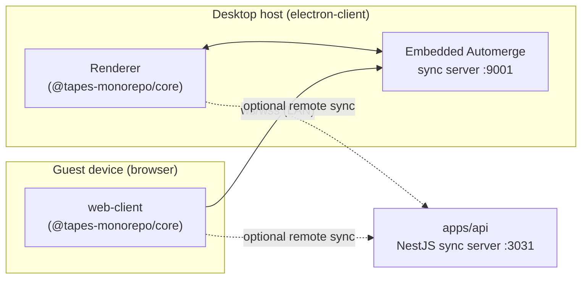

# Tapes

Tapes is a local-first audio recording app. You record in the browser. Your
recordings stay on your own devices and sync across your local network with
[Automerge](https://automerge.org/) CRDTs. There is no central database.

The desktop app is the sync **host**. It stores the shared data and serves the
recording UI to other devices on the LAN. Those devices join as **guests** by
scanning a QR code, and record into the same library.

Recorded audio is not carried in the Automerge document. The bytes are stored on
the host and addressed by their sha-256 hash. The document holds only a
descriptor for each recording. Guests upload what they record and fetch what they
play over the host's `/blobs` endpoint.

## Monorepo layout

This is a [Turborepo](https://turborepo.com/) monorepo managed with Yarn 4.

### Apps

| Package                | Description                                                                   | Dev port |
| ---------------------- | ----------------------------------------------------------------------------- | -------- |
| `apps/web-client`      | Vite and React shell that mounts the Tapes app and captures microphone audio. | `3000`   |
| `apps/electron-client` | Desktop **host**. Embeds `web-client` and runs the LAN sync server.           | —        |
| `apps/api`             | Standalone NestJS Automerge sync server. An alternative remote backend.       | `3031`   |
| `apps/web`             | Next.js marketing site.                                                       | `3002`   |
| `apps/docs`            | Next.js documentation site.                                                   | `3001`   |

The host's embedded sync server listens on port `9001` by default. If that port
is taken it uses whatever port the OS hands it. Set `TAPES_SYNC_SERVER_PORT` to
pick a different one.

### Packages

| Package                             | Description                                                                       |
| ----------------------------------- | --------------------------------------------------------------------------------- |
| `@tapes-monorepo/core`              | The Tapes application itself: `App`, views, context, sync helpers and QR pairing. |
| `@tapes-monorepo/ui`                | Shared presentational React components, styled with Tailwind.                     |
| `@tapes-monorepo/tailwind-config`   | Shared Tailwind theme.                                                            |
| `@tapes-monorepo/eslint-config`     | Shared ESLint configurations.                                                     |
| `@tapes-monorepo/typescript-config` | Shared `tsconfig.json` bases.                                                     |

The UI lives in `packages/core/app/`. Both `web-client` and the electron
renderer mount it, so the same app runs in a browser and inside the desktop host.

## Architecture


```mermaid
flowchart LR
    subgraph host["Desktop host (electron-client)"]
        renderer["Renderer<br/>(@tapes-monorepo/core)"]
        sync["Embedded Automerge<br/>sync server :9001"]
        renderer <--> sync
    end

    subgraph guest["Guest device (browser)"]
        webclient["web-client<br/>(@tapes-monorepo/core)"]
    end

    api["apps/api<br/>NestJS sync server :3031"]

    webclient -- "ws/wss (LAN)" --> sync
    renderer -. "optional remote sync" .-> api
    webclient -. "optional remote sync" .-> api
```

Each shell builds its own Automerge repo and passes it to `App`. Storage and
networking are platform-specific, so only the shell knows where its sync server
lives.

- The web client stores documents in IndexedDB. It talks to other tabs over a
  broadcast channel and to the host over a WebSocket.
- The host's embedded sync server stores documents and blobs on the filesystem.
- Guests reach the host over the LAN. In development the `web-client` dev server
  proxies `/sync` and `/blobs` to it. See `apps/web-client/vite.config.ts`.
- `apps/api` is an independent, filesystem-backed sync server. It can act as a
  remote backend. Its auth module is currently commented out.

## Prerequisites

- Node.js 24. The version is pinned in [`.nvmrc`](./.nvmrc).
- Yarn 4, declared in `packageManager`. Run `corepack enable` once so the pinned
  version is used.
- macOS for the full recording flow. The dev scripts read the LAN IP with
  `ipconfig getifaddr en0`. The desktop host shells out to
  [SoX](https://sourceforge.net/projects/sox/) to record and to
  [`switchaudio-osx`](https://github.com/deweller/switchaudio-osx) to select an
  input. On Linux and Windows the non-audio parts build and run, but end-to-end
  recording is not supported.

## Getting started

```sh
corepack enable   # once, to activate the pinned Yarn 4
yarn              # install dependencies
yarn dev          # start all apps in dev mode
```

### Local HTTPS

Browsers only expose the microphone in a secure context. LAN guests therefore
cannot record over plain HTTP. Use HTTPS on the LAN IP instead:

```sh
yarn dev:https
```

That script starts `ui`, `core`, `web-client`, the electron host and `api`. The
web client gets TLS from `@vitejs/plugin-basic-ssl`. The host advertises an
`https://<lan-ip>:3000` URL to guests. It also generates a self-signed
certificate for its own sync server, with the LAN IP in the certificate SAN.

`apps/api` serves over HTTPS in development. It expects `localhost-key.pem` and
`localhost-cert.pem` in `apps/api/`. Generate them with `yarn workspace api cert`.

## Scripts

Run these from the repo root. Each one fans out through Turborepo.

| Command            | Description                                         |
| ------------------ | --------------------------------------------------- |
| `yarn dev`         | Start all apps in dev mode.                         |
| `yarn dev:https`   | Start the LAN recording surfaces over HTTPS.        |
| `yarn build`       | Build all apps and packages.                        |
| `yarn lint`        | Lint everything.                                    |
| `yarn check-types` | Type-check everything.                              |
| `yarn test`        | Run unit tests.                                     |
| `yarn format`      | Prettier-format every `.ts`, `.tsx` and `.md` file. |
| `yarn clean`       | Remove build artifacts.                             |

## Versioning and releases

Versioning uses [Changesets](https://github.com/changesets/changesets). Add a
changeset when your change affects a published package:

```sh
yarn changeset
```

On push to `main` the Release workflow opens or updates a "Version Packages" pull
request that applies the pending changesets. Dependency updates are automated
with [Renovate](https://docs.renovatebot.com/).

## CI

Pull requests to `main` run two jobs. See
[`.github/workflows/ci.yml`](./.github/workflows/ci.yml).

- **Build & Lint** runs `yarn lint`, `yarn check-types` and `yarn build`, then the
  unit tests for `core`, `electron-client` and `web-client`. The `apps/api` Jest
  suite is excluded because of a pre-existing compile failure.
- **E2E (web-client)** runs Playwright against Chromium. The job first starts
  PulseAudio with two virtual sources, so the mic-capture tests have inputs to
  enumerate and switch between.

The electron end-to-end suite runs nightly instead of per pull request, on a
macOS runner. It packages the desktop app and records through SoX, which is slow
and macOS-only. See
[`.github/workflows/e2e-electron.yml`](./.github/workflows/e2e-electron.yml). You
can also trigger it by hand.

## Documentation

Each app and package has its own README with setup and environment details.
Contribution guidelines are in [`CONTRIBUTING.md`](./CONTRIBUTING.md). Guidance
for AI agents is in [`CLAUDE.md`](./CLAUDE.md).
